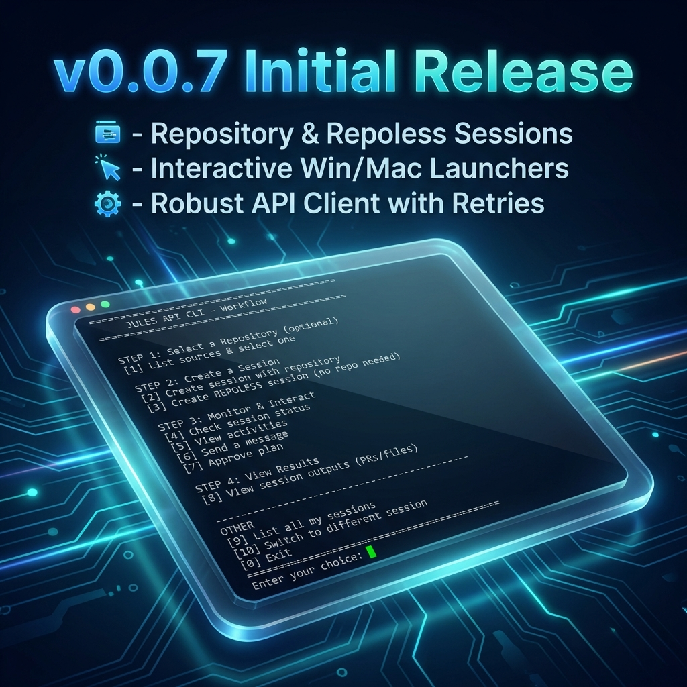

# Jules API CLI

[](https://www.gnu.org/licenses/gpl-3.0)

A command-line interface for the [Jules REST API](https://jules.google/docs/api/reference/) that provides simple, intuitive access to Jules's AI coding assistant capabilities.



## Features

- **Sources** - List and inspect connected GitHub repositories.
- **Sessions** - Create repository-based or **Repoless** (serverless) coding sessions.
- **Activities** - Monitor real-time progress, plans, and AI responses.
- **Workflow-Based UI** - Guided interactive menu for a seamless developer experience.
- **Scriptable** - Full support for raw CLI flags and multiple output formats (JSON, Table, Minimal).

## Quick Start

### 1. Install

```bash
# Clone the repository
git clone https://github.com/krishnakanthb13/jules_api_cli.git
cd jules_api_cli

# Requires uv (fast Python package manager)
# Install uv: pip install uv  OR  winget install astral-sh.uv

# Use the interactive launcher
# Windows:
launch.bat

# Unix/Mac:
chmod +x launch.sh
./launch.sh
```

### 2. Configure

Get your API key from [jules.google.com/settings](https://jules.google.com/settings) and add it to `.env`:

```env
JULES_API_KEY=your-api-key-here
```

### 3. Workflow Usage

The interactive launchers (`launch.bat` / `launch.sh`) guide you through a 4-step workflow:

1.  **STEP 1: Select a Repository** - List your connected GitHub sources and select one.
2.  **STEP 2: Create a Session** - Start a new task (Repository-based or Repoless).
3.  **STEP 3: Monitor & Interact** - Check status, view activities, send messages, or approve plans.
4.  **STEP 4: View Results** - Get links to generated Pull Requests or change sets.

## Commands Reference

If you prefer using the CLI directly without the interactive menu:

### Sources
```bash
# List all connected repositories
python -m src.cli sources list --format table

# Get details for a specific source
python -m src.cli sources get github-owner-repo
```

### Sessions
```bash
# Create a standard session
python -m src.cli sessions create --prompt "Fix typo" --source github-owner-repo

# Create a REPOLESS session using a text prompt
python -m src.cli sessions create --prompt "Write a python script to parse JSON" --repoless

# Create a REPOLESS session using a file (.md or .txt)
python -m src.cli sessions create --prompt-file ./task.md --repoless

# Interact with a session
python -m src.cli sessions send <session_id> "Add more comments"
python -m src.cli sessions approve <session_id>
```

### Activities
```bash
# List activities for a session
python -m src.cli activities list <session_id>

# Get specific activity details
python -m src.cli activities get <session_id> <activity_id>
```

## Global Options

| Flag | Shortcut | Description |
|:--- |:--- |:--- |
| `--format` | `-f` | Output format: `json`, `table`, `minimal`, `raw` (default: `table`) |
| `--verbose`| `-v` | Enable verbose logging (API requests and responses) |
| `--prompt-file`| `-F` | (sessions create) Path to a `.md` or `.txt` file for the prompt |
| `--version` | `-V` | Show version information |
| `--help` | `-h` | Show help for any command |

## Reference Tables

### Session States
| State | Description |
|:--- |:--- |
| `QUEUED` | Session is waiting to start. |
| `PLANNING` | Jules is creating a plan. |
| `AWAITING_PLAN_APPROVAL` | Plan needs approval (if `--require-approval` was set). |
| `AWAITING_USER_FEEDBACK` | Jules is waiting for your input. |
| `IN_PROGRESS` | Jules is executing the plan. |
| `PAUSED` | Session is paused. |
| `COMPLETED` | Session finished successfully. |
| `FAILED` | Session encountered an error. |

### Activity Types
| Type | Description |
|:--- |:--- |
| `planGenerated` | Jules created a proposed plan. |
| `userMessaged` | You sent a message to the session. |
| `agentMessaged` | Jules responded with a message. |
| `progressUpdated` | A status update during execution. |
| `sessionCompleted` | The task is finished. |

## Requirements

- Python 3.9+
- [uv](https://github.com/astral-sh/uv) or `pip`
- Jules API key ([get one here](https://jules.google.com/settings))
- At least one GitHub repository connected (for repository-based sessions)

### Installation

```bash
# Clone the repository
git clone https://github.com/krishnakanthb13/jules_api_cli.git
cd jules_api_cli

# Using uv (recommended)
uv sync

# Or using pip
pip install -e .
```

## License

This project is licensed under the GNU GPL v3 License - see the [LICENSE](LICENSE) file for details.

## Links

- [Jules Website](https://jules.google)
- [API Documentation](https://jules.google/docs/api/reference/)
- [Changelog](https://jules.google/docs/changelog/)
